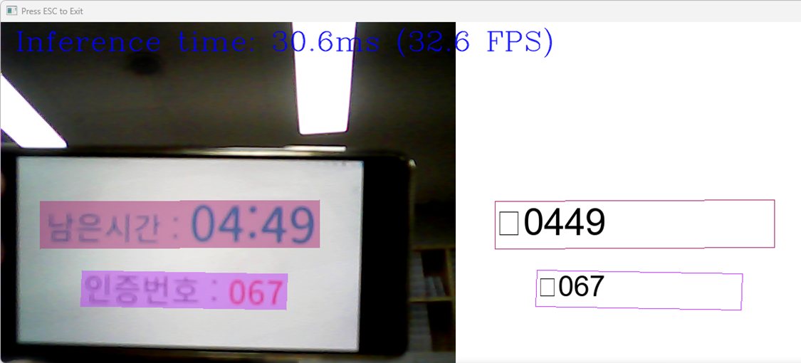
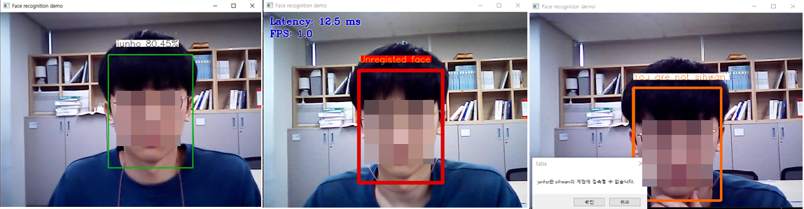

# Project name

* (간략히 전체 프로젝트를 설명하고, 최종 목표가 무엇인지에 대해 기술)
```
OMZ 내 얼굴 인식, 글자 인식 모델을 활용한 출결 시스템 개발
```

## Requirement

* (프로젝트를 실행시키기 위한 최소 requirement들에 대해 기술)

```
* 10th generation Intel® CoreTM processor onwards
* At least 16GB RAM
* Windows 11
* Python 3.9.13
```


## Clone code

* (Code clone 방법에 대해서 기술)

```
git clone https://github.com/TylerWhLab/FaceAndTextRecog.git
```

## Prerequite

* (프로잭트를 실행하기 위해 필요한 dependencies 및 configuration들이 있다면, 설치 및 설정방법에 대해 기술)
```
python -m venv .venv
.venv/Scripts/activate
pip install openvino-dev[tensorflow,onnx,pytorch]
git clone https://github.com/openvinotoolkit/open_model_zoo.git
cd open_model_zoo
python -m pip install -U pip
pip install -r .\demos\common\python\requirments.txt

pip install -q "paddlepaddle==2.5.0rc0"
pip install -q "pyclipper>=1.2.1" "shapely>=1.7.1"

pip install python-dotenv
pip install selenium

https://storage.openvinotoolkit.org/repositories/openvino/packages/2023.0.1/windows/w_openvino_toolkit_windows_2023.0.1.11005.fa1c41994f3_x86_64.zip
=> C:\Program Files (x86)\Intel\openvino_2023 이름으로 압축해제
```

## Steps to build

* (프로젝트를 실행을 위해 빌드 절차 기술)
```
"C:\Program Files (x86)\Intel\openvino_2023\setupvars.bat"
<your path>\.venv\Scripts\activate
```

## Steps to run

* (프로젝트 실행방법에 대해서 기술, 특별한 사용방법이 있다면 같이 기술)

```
// run image recog server
python text_detect_inImage.py
```

```
// run face recog client
# .env
MY_ID = id
MY_PW = pw

python .\ai_attendance.py -fg "<your path>\fg_gallaray"
```

## Output





## Appendix

* (참고 자료 및 알아두어야할 사항들 기술)
